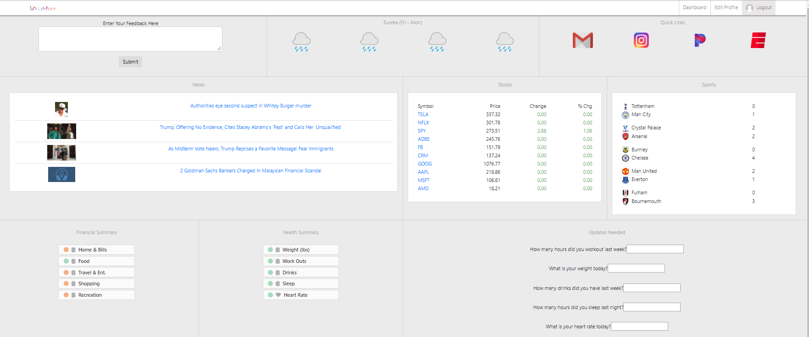
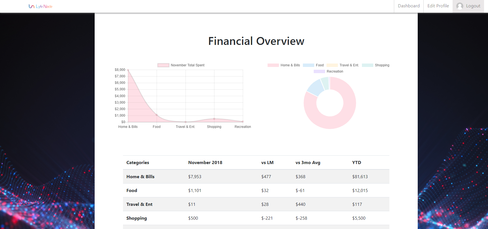
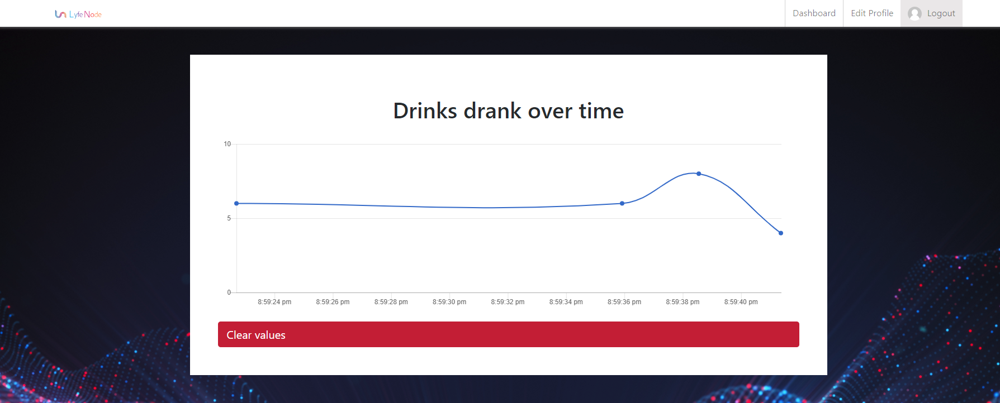

# LyfeNode

## Overview

LyfeNode is a web application that helps usersget through life’s challenges, big and small. It encourages people to conquer challenging tasks one small chunk at a time

## Technologies Used

###General

- MERN stack
- Heroku
- mLab
- Redux

###Security

- Bcrypt
- JWT
- JSON Web Token
- Passport

###Libraries

- Chart.js
- Gravatar
- Validator
- Concurrently

## Dashboard

## Website

http://www.lyfenode.com
